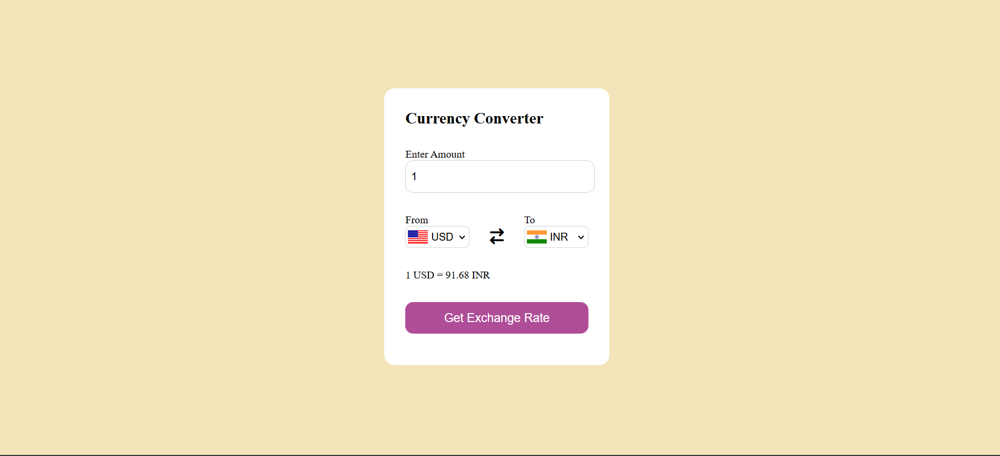
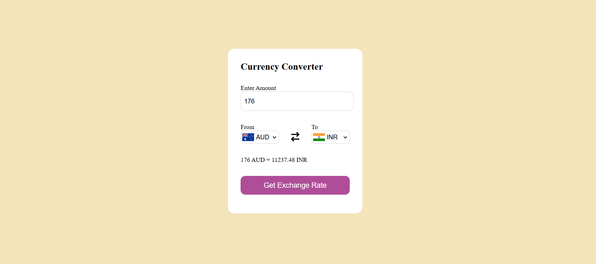

# 💱 Currency Converter Web App

A simple and interactive **Currency Converter** built using **HTML, CSS, and JavaScript**.  
It uses a real-time currency exchange API to convert one currency into another instantly.

---

## 🚀 Live Demo
🔗https://sneha20056.github.io/currency-converter/

---

## 📸 Screenshots

### 🔹 Home Page

### 🔹 Currency Conversion in Action

---

## ✨ Features
- Convert currencies in real time
- Supports multiple international currencies
- Country flags update automatically
- Uses **Fetch API** with **async/await**
- Clean and responsive UI

---

## 🛠️ Tech Stack
- HTML5
- CSS3
- JavaScript (ES6)
- Fetch API
- REST Currency API

---

---

## 📌 How It Works
- User selects **From** and **To** currency
- App fetches exchange rate using API
- Result is calculated and displayed instantly
- Flags change based on selected currency

---

⭐ If you like this project, don't forget to star the repository!
